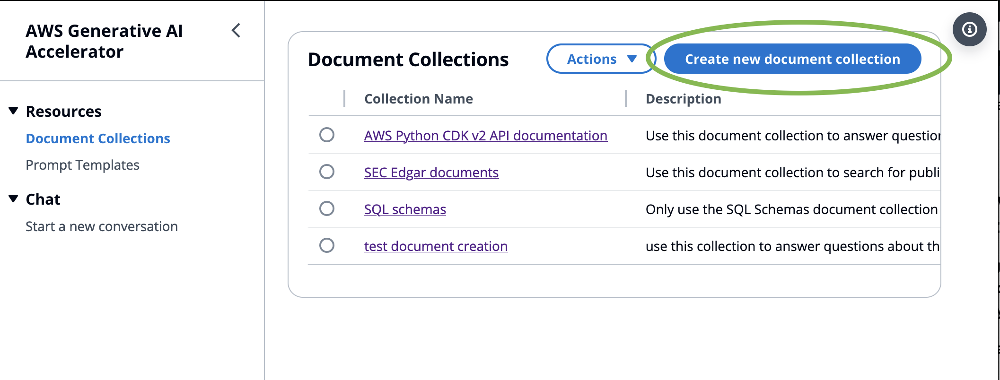
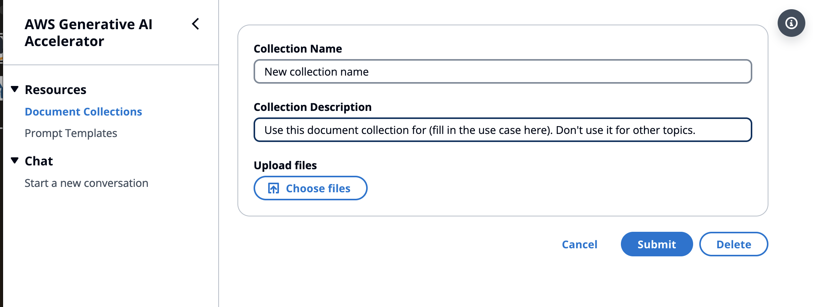
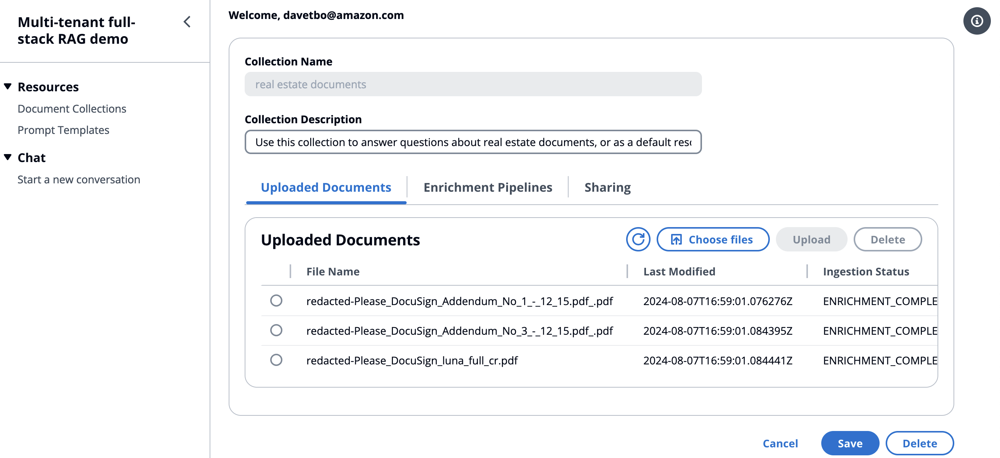
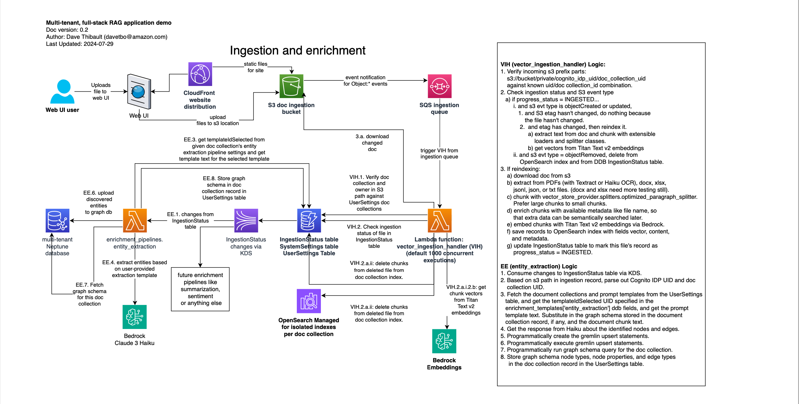
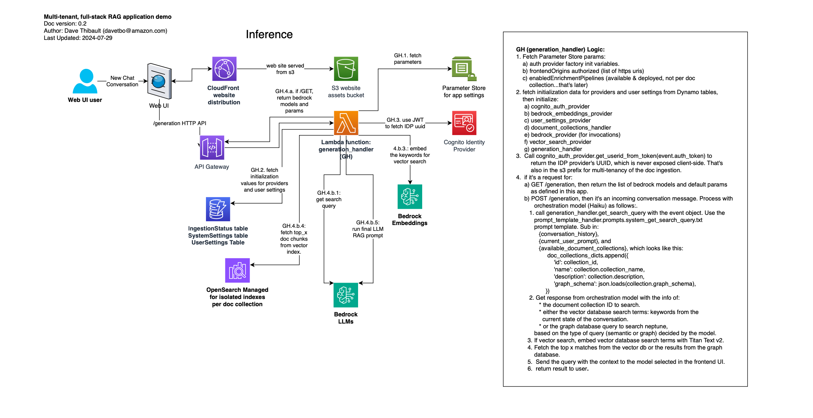
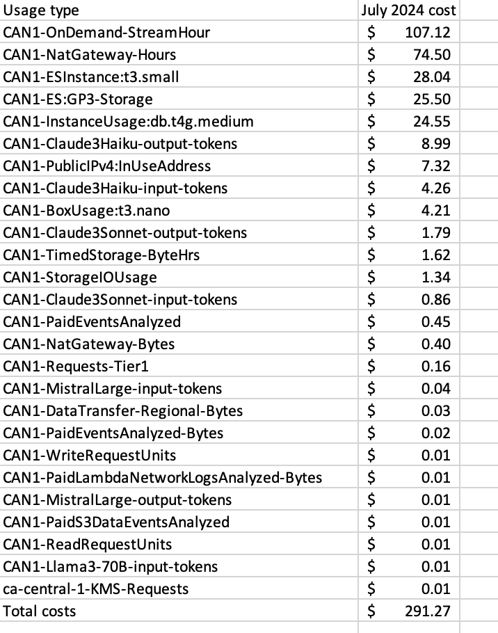

# Multi-tenant, full-stack RAG application demo

## Goals
Welcome! The goal of this stack is to demonstrate:
* how to create a multi-tenant RAG application using AWS generative AI services.
* how to use OpenSearch Managed directly as a vector store provider.
* how to handle event-based ingestion of documents, without requiring manual or programmatic triggering of new document ingestion.
* how to implement sharing of document collections with other users.
* how to do multi-RAG query orchestration across multiple document collections
* how to do graph RAG, by providing example entity extraction pipelines and example prompt orchestration of user prompts across vector or graph databases, depending on the user prompt contents.

## Getting started
To get started, do the following:
1. git clone this repository or download the main branch.

2. [Install the AWS Python CDK](https://docs.aws.amazon.com/cdk/v2/guide/getting_started.html) in your development environment, if you don't already have it.

3. After [setting up your programmatic access](https://docs.aws.amazon.com/cdk/v2/guide/getting_started.html#getting_started_auth) and [bootstrapping](https://docs.aws.amazon.com/cdk/v2/guide/getting_started.html#getting_started_bootstrap) in the previous guide, open a terminal window and navigate to the root folder of this repository where you cloned it.

4. Before installing, copy `backend/lib/__config__sample.py` to `backend/lib/__config__.py`, and fix any defaults. Specific ones you might want to change are:

   * app_name (defaults to "Multi-tenant full-stack RAG demo")

   * allowed_email_domains under the auth_provider_params['cognito'] section. This will control which email domains are allowed to create accounts using Cognito self-service account creation. Without editing this you'll have to create users in the Cognito user pool created in the console.

   * cognito_domain_prefix under the Cognito section. This must be globally unique in AWS, and will have your deployment region and account appended to it, so you can deploy to multiple regions and accounts easily with the same prefix and to increase the likelihood of the default value just working for you.
   
   * verification_message_settings under the Cognito section, which controls the email subject and body sent after a user signs up, for them to receive a confirmation code to complete sign-up.

   * extraction_model_id under the enrichment_pipelines['entity_extraction'] section. Defaults to Haiku and should be good left as default.

   * ec2_enable_traffic_from_ip in the vector_store_provider_params['opensearch_managed'] section. This allows your IP to connect to the OpenSearch Dashboards proxy that's created on a small EC2 instance. Otherwise you'll have to use the EC2 console, find the instance created, and add your IP to the security group later. You only need to enable it for HTTPS.

5. type `./install.sh` and hit enter. 
    a. Use -nf to make it skip installing the frontend UI stack as well as the backend stack. You should not use this first time through, but if you're doing development on only backend components you might be able to avoid reinstalling the frontend every time as well, so it's optional after the first time.
    b. Optionally use -y to reply yes to all confirmation screens to create IAM roles for the various stacks. Note that there are many stacks and each one that creates IAM roles will stop and prompt you during the install if you don't use -y. 
    c. Optionally use -h to hotswap stack contents if you're actively developing, but not advised for production because it will introduce drift in your stack resources.

6. It will take about 20 or 30 minutes to deploy the whole stack, backend and frontend. At the end of the frontend deployment, it will print out the URL of the CloudFront distribution for the frontend UI. Click that to get started.

7. When you first get to the login screen, use the create account tab and create a new user. You must use the same domain name you added to the __config__.py file in the allowed_email_domains list. If you skipped that part, you can create users in the Cognito console, or update the __config__.py file and rerun ./install.sh to reflect changes.
8. After setting up your Cognito user you should be able to log in.
8. Create a document collection and upload some documents. When creating the collection, use the description to describe specifically when to search this collection and when not to, as in the example below:

`Use this document collection for (fill in the use case here). Don't use it for other topics.`

* Click create document collection
 

* Enter details about the collection and click Save.

* Upload files to the document collection

9. Click on Start a Conversation in the left nav. Click the first Anthropic model for Haiku (`anthropic.claude-3-haiku-20240307-v1:0`), and start asking questions about your documents!

## Architecture

### Ingestion architecture

### Inference architecture

## Cost to run this stack

The image below shows the costs I incurred running this in my personal account and developing it. It could be tuned for some of the larger-ticket items (like eliminating NAT gateways, minimizing Kinesis retention time, or using provisioned instead of on-demand throughput). Note that the core costs of OpenSearch Managed and Bedrock Haiku (my model of choice almost exclusively), are $28.04 and $4.26, respectively, for the month.

Switching from Kinesis Streams to DynamoDB streams (free tier available) is high on the priority list.

## Feature status and roadmap
 | Feature | Status | Comments |
 |---------|--------|----------|
 | Event-based, highly parallel, serverless ingestion| complete | Uses S3 events -> SQS -> Lambda to process docs in real-time when they hit the S3 bucket. Currently, users can upload files into the UI directly. Future functionality will include bulk upload capabilities.|
 | Document collections CRUD | complete | Document collections are like Bedrock KBs, backed by OpenSearch managed. Web uploads currently supported. Bulk uploads require backend access for now, but will be supported in the future by a cross-platform client (like the WorkDocs client) that would allow easy syncing of whole folders. Also, will support accepting an S3 URI and a role with permissions to access it, to sync from a given bucket and path. | 
 | Prompt templates CRUD | complete | Prompt templates can be created/read/updated/deleted from the web UI, and associated with one or more models. For example, you can create a default template for all the Claude 3 models. | 
 | Text generation | complete | Chat history and current message are automatically evaluated for whether a RAG search is needed, given all of the user's current document collections. In the future, will add faceted search-style document collection inclusion/exclusion. | 
 | Model parameters in the UI | complete | Provide sliders for model parameters, like in the Bedrock chat playground. | 
 | Multi-RAG query orchestration with graph data and semantic search| complete |  Requires descriptive text in the document collections explaining with which subjects they are intended for use. | 
 | Ingestion status of files | complete | |
 | Entity extraction pipeline | complete | when enabled, uses Haiku and a given extraction template to store data in Neptune database. | 
 | Default prompts for each model family | complete |
  | Sharing document collections across users at the collection level | complete | Works like Quip where you can search for named users. Doesn't yet support asterisk for sharing with everyone who's logged in. |
 | Conversation history | in progress | The current conversation has memory but it doesn't yet offer saving of conversations. | 
  | Custom logos instead of "Multi-tenant full-stack rag demo" to enable customized field demos.| partially complete | no logos yet, but the app title is configurable through backend/lib/__config__.py |
 | Saving conversation history | | |
 | Paging through long lists of uploaded files |||
 | Feedback | | |
 | Image generation | | |
 | Multi-modal queries | | |
 | Response streaming | | currently shows a "typing" gif, but not yet streaming.|
 | Allow user to specify that doc collections are optimized for long or short answers | | Currently optimized for longer answers which can also easily retrieve shorter answers to meet both needs in shortest term.|
 | Sharing document collections across users at the individual document level | unlikely to be soon | |
 | Looping to solve complex code generation for Q&A tasks. | | |
 | Add support for other doc types besides plain text| | right now it treats everything it doesn't recognize as plain text, so it can handle code files with any extension, for example, but doesn't do PDFs or Office docs yet. |
 | Add crawlers | | |

